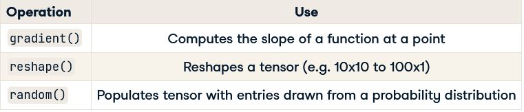

## Introduction to Tensorflow using Python

### Tensorflow
- Open-source library for graph based numerical computation, developed by Google Brain
- Has low and high level APIs for addition, multiplication, differentiation and building ML models.

#### Important changes in TensorFlow 2.0
- Eager execution by default
- Model building with Keras and Estimators

#### Defining tensors in TensorFlow
- **Tensor** : Generalization of vectors and matrices to potentially higher dimensions.

```python
import tensorflow as tf

# 0D tensor
d0 = tf.ones((1,))

# 1D
d1 = tf.ones((2, ))

# 2D tensor
d2 = tf.ones((2, 2))

# 3D tensor
d3 = tf.ones((2, 2, 2))

# print the 3D tensor
print(d3.numpy())
```

#### Defining constants in Tensorflow
- A constant is the simplest category of tensor. A constant does not change and cannot be trained. It can have any dimesions.
- The constant b is 2x2 tensor, which is constructed from the 1-dimensional tensor: 1,2,3,4

```python
from tensorflow import constant

# define a 2x3 constant
a = constant(3, shape=[2,3])

# Define a 2x2 constant
b = constant([1,2,3,4], shape=[2,2])
```

#### Defining and initializing variables
- Unlike a constant a variables value can be change during the computation.
- a0 is a 1-D tensor with 6 elements.

```python
import tensorflow as tf

# define a variable
a0 = tf.Variable([1,2,3,4,5,6], dtype=tf.float32)
a1 = tf.Variable([1,2,3,4,5,6], dtype=tf.int16)

# define a constant b
b = tf.constant(2, tf.float32)

# compute their product
c0 = tf.multiply(a0, b)
c1 = a0*b
```

### Basic Operations
- **Tensorflow Operation** : Tensorflow has a model of computation that revolves around the use of graphs. A Tensorflow graph contains edges and nodes, where the edges are tensors and the nodes are operations.

#### Applying the addition operator
- The `add()` operator performs element-wise addition with two tensors. Elemet-wise addition requires both tensors to have the same shape.

```python
from tensorflow import constant, add

# define 0-d tensors
A0 = constant([1])
B0 = constant([2])

A1 = constant([1,2])
B1 = constant([3,4])

A2 = constant([[1,2], [3,4]])
B2 = constant([[5,6], [7,8]])

# applying addition operator
C0 = add(A0, B0) # scalar addition
C1 = add(A1, B1) # vector addition
C2 = add(A2, B2) # matrix addition
```

#### Multiplication in TensorFlow
- Element wise multiplication performed using `multiply()` operation. The tensors multiplied must have the same shape.
- **Matrix mul** : performed with `matmul()` operator. It requires number of coulmns of A to be equal to number of rows of B.

#### Summing over tensor dimensions
- The `reduce_sum()` operator sums over the dimensions of a tensor. This can be used to sum over all dimensions of a tensor or just one.
- `reduce_sum(A)` sums over all dimensions of A, `reduce_sum(A,i)` sums over dimension i.

#### Advanced operations



#### Finding the optimum
- In many ML problems, we need to find an optimum, i.e, a minimum or maximum.We may,want to find the model parameters that minimize the loss function or maximize the objective function.
- Fortunately, we need to do this by using the gradient operation, which tells us the slope of a function at a point. We start this process by passing points to the gradient operation unitl we find one where gradient is zero.
- Next we check if the gradient is increasing or decreasing at that point.If its increasing, we have minimum (change in gradient >0), otherwise we have maximum (change in gradient < 0)

#### Gradients in TensorFlow
- We will start by defining a variable x, which we initialize to -1.0. We then define y=x^2 within the instance of gradient tape.
- Apply watch method to an instance of gradient tape and then pass the variable x. This will allow us to compute the rate of change of y w.r.t x.
- Next we compute the gradient of y w.r.t x using the tape instance of gradient tape. The operation computes the slope of y at a point.
- Much of the differentiation we do in DL models will be handled by high level APIs, however gradient tape remains an invaluable tool for building advanced and custom models.

```python
import tensorflow as tf

# define x
x = tf.Variable(-1.0)

# define y within instance of GradientTape
with tf.GradientTape() as tape:
    tape.watch(x)
    y = tf.multiply(x,x)
    
# evaluate the gradient of y at x=-1
g = tape.gradient(y, x)
print(g.numpy())
```

#### Reshape (Image as tensors)
- Some algorithms require us to **reshape matrices into vectors before using them as inputs**.
- Create random grayscale image. Use it to populate a 2x2 matrix. We can then reshape it into a (4,1) vector.
- For color images generate 3 such matrices to form a (2x2x3) tensor, then reshape it into (4,3) tensor.

```python
import tensorflow as tf

# generate grayscale image
gray = tf.random.uniform([2,2], maxval=255, dtype='int32')

# reshape grayscale image
gray = tf.reshape(gray, [2*2, 1])

# generate color image
color = tf.random.uniform([2,2,3], maxval=255, dtype='int32')

# reshape color image
color = tf.reshape(color, [2*2, 3])
```

## Linear Models with TF

### Input data
- Import data using pandas, convert data to numpy array, which can be used without modification in TensorFlow.

```python
import numpy as np
import pandas as pd

# load data from csv
housing = pd.read_csv('kc_housing.csv')

# convert to numpy array
housing = np.array(housing)
```

#### Using mixed type datasets
- Datasets with different datatype columns datetime, float, boolean. `tf.cast or np.array` can be used to convert the datatypes.

```python
price = tf.cast(housing['price'], tf.float32)
waterfront = tf.cast(housing['waterfront'], tf.bool)

# or
price = np.array(housing['price'], np.float32)
waterfront = np.array(housing['waterfront'], np.bool)
```

### Loss functions
- Tensorflow has operations for common loss functions. Typical choices for training linear models include the **Mean squared error loss(MSE), the Mean absolute error loss(MAE) and the Huber loss**
- All these loss functions are accessible from `tf.keras.losses()`, **`tf.keras.losses.mse(), tf.keras.losses.mae(), tf.keras.losses.Huber()`**

#### Why do we care about loss functions?
- **MSE** : strongly penalizes outliers and has high(gradient) sensitivity near the minimum.
- **MAE** : Scales linearly with the size of error and has low sensitivity near minimum.
- For greater sensitivity near the minimum, we will use MAE or Huber loss. To minimize the impact of outliers, we will use the MSE or HUber loss.

#### Defining a loss function
- To use the loss we will need two tensors to compute it: the actual values or 'targets' tensor and the predicted values or 'predictions'. Passing them to the MSR operation will return a single number: the average of the squared differences between the actual and predicted values.

```python
import tensorflow as tf

# compute the MSE loss
loss = tf.keras.losses.mse(targets, predictions)
```

#### Linear regression model
- Define linear regression function that accepts intercept, slope and features and returns a prediction.
- Next define a loss function that accepts the slope and intercept of a linear model , the variables, and the input data, the targets and the features. It then makes a prediction and computes and returns the associated MSE loss.

```python
# define a linear regression model

def linear_regression(intercept, slope=slope, features=features):
    return intercept + features * slope
    
# define a loss function to compute the MSE
def loss_function(intercept, slope, targets = targets, features = features):
    # compute the predictions for a linear model
    predictions = linear_regression(intercept, slope)
    
    # return the loss
    return tf.keras.losses.mse(targets, predictions)
    
# evaluate the loss function using a test dataset
loss_function(intercept, slope, test_targets, test_features)
```

### Training a Linear Regression model
- A linear regression model assumes a linear relationship. `price = intercept + size * slope + error`. The difference between the predicted and the actual price is the error, which can be used to construct a loss function.
- Univariate regression : there is only one feature. Mutiple regression models have more than one feature.
- Initialize target and features. **Also initialize the intercept and slope as trainable variables.**
- After that we **define a model which will be used to make prediction by multiplying size and slope and then adding the intercept**.
- Next step is to **define a loss function**. This function will take the model's parameters and the data as an input. We first use the model to predict the values and then set the function to return the mean squared error loss.
- With loss function defined, the next step is to **define an optimization operation,**  using adam optimizer. Executing this operation will change the slope and intercept in a direction that will lower the value of the loss.
- We will next perform **minimization on the loss function using the optimizer**. Notice that we've passed the loss function as a lambda function to the minimize operation. We also supplied a variable list, which contains intercept and slope.
- The optimization step is executed 1000 times.

```python
# define the targets and features
price = np.array(housing['price'], np.float32)
size = np.array(housing['sqft_living'], np.float32)

# define the intercept and slope
intercept = tf.Variable(0.1, np.float32)
slope = tf.Variable(0.1, np.float32)

# define a linear regression model
def linear_regression(intercept, slope, features=size):
    return intercept + features * slope    
    
# compute the predicted values and loss
def loss_function(intercept, slope, targets=price, features=size):
    predictions = linear_regression(intercept, slope)
    return tf.keras.losses.mse(targets, predictions)
    
# define an optimization operation
opt = tf.keras.optimizers.Adam()

# minimize the loss functions and print the loss
for j in range(1000):
    opt.minimize(lambda: loss_function(intercept, slope), var_list=['intercept,slope'])
    print(loss_function(intercept, slope))
    
# print the trained parameters
print(intercept.numpy(), slope.numpy())
```


